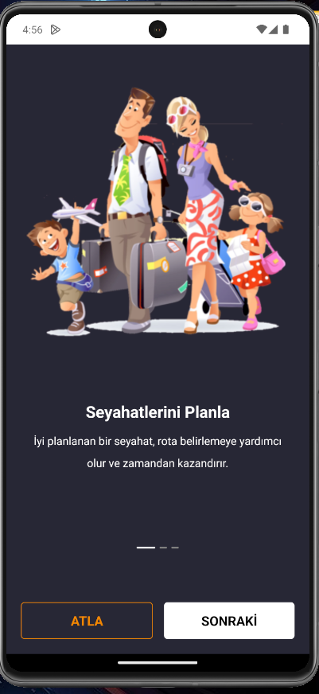
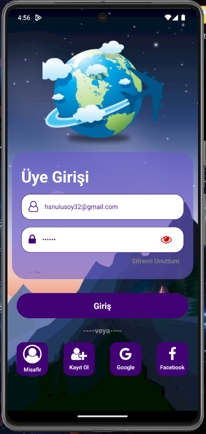
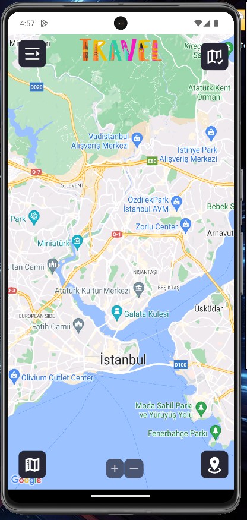

# Map Notes App

- Bu proje, React Native kullanılarak geliştirilmiş bir harita uygulamasıdır. Uygulama Firebase entegrasyonu ile kullanıcı girişi ve veritabanı yönetimi sağlar. Ayrıca, Context API kullanılarak veriler tek merkezden yönetilir.

-- Proje Detayları
- Onboarding Screen ile karşılama ekranı yapılandırıldı.
- Guest girişi ile kullanıcı girişi yapmadan sadece harita özelliği ve map typeları aktif olan ekran açılmaktadır.
- Firebase Authentication kullanılarak Google  ile giriş sonrası tüm özellikleri etkinleşmektedir.
- Ana Ekran: Harita türlerini değiştirebileceğiniz dropdown menü, liste ve ekleme ekranlarına yönlendiren butonlar, harita özelliğini değiştiren dropdown menü, zoom özelliğini kullanbileceğiz butonlar ve drawer navigasyonunu içerir.
- Drawer Menü: Kullanıcı bilgileri ve bazı ekranlara yönlenirmeler ile kullanıcı çıkış butonu burada bulunmaktadır.
- Not Ekleme Ekranı: Harita üzerinde lokasyon seçimi yaparak not ekleyebileceğiniz bir ekran.
Girişte mapView mobile lokasyon izni verdi ise coordinat bilgisini dinamik olarak alıp lokasyon durumuna göre gösterilmektedir. Herhangi bir lokasyon seçim ile not kaydı gerçeklştirilebilir.
- Liste Ekranı: Filtreleme, not sayacı, kayıtlı notların detay ekranın yönlendirme, not üzerinden silme ve notu düzenlemenin gerçekleştirilebildiği ekrandır. Not türüne göre dinamik icon ve style oluşturulmuştur. Filtreleme dropdown menüdeki tür ile yapılabilmektedir.
- Not Detay Ekranı: Kaydedilen notun detaylarına ulaşılabildiği ekrana kayıtlı lokasyon coordinatları ile dinamik olarak harita üzerinde marker'ı gösterir. Ayrıca düzenleme/silme butonları bulunmaktadır.

🎯 Özellikler:
Onboarding Screen
Kullanıcı Girişi ve Google ile Oturum Yönetimi
Firebase Authentication ve Firestore ile Veri Yönetimi
Context API ile Veri Yönetimi
Harita Görüntüsü İçin Esneklik
Marker İşaretleme, Düzenleme ve Silme
Kullanıcı Lokasyon Bilgileri ve Görselleştirme
Kullanıcı Bilgilerinin Kolay Ulaşılabilirliği
Veri Ekleme, Listeleme, Filtreleme, Düzenleme ve Silme İşlemleri

Bu proje, harita üzerinde not ekleme özelliğine farklı bir yaklaşım kazandırıyor ve veri yönetimini kolaylıkla sağlayarak kullanıcılarına daha etkili bir deneyim sunuyor! 🌟
Geliştirilen bu uygulama hakkında yorumlarınız ve geri bildirimleriniz sonraki projeler için rehber olacaktır! 🔗✨

# Proje yüklenirken api key ler firebase google-services.json dosyası ile style kısımlarını içeren kodlar kaldırılmıştır. Proje kod incelemesi için yüklenmiş olup projeyi indirerek uygulama çalışmayacaktır.

- Önerileriniz için hsnulusoy32@gmail.com

## Preview

# Map App
# MyMapNotesApp-ReactNative
